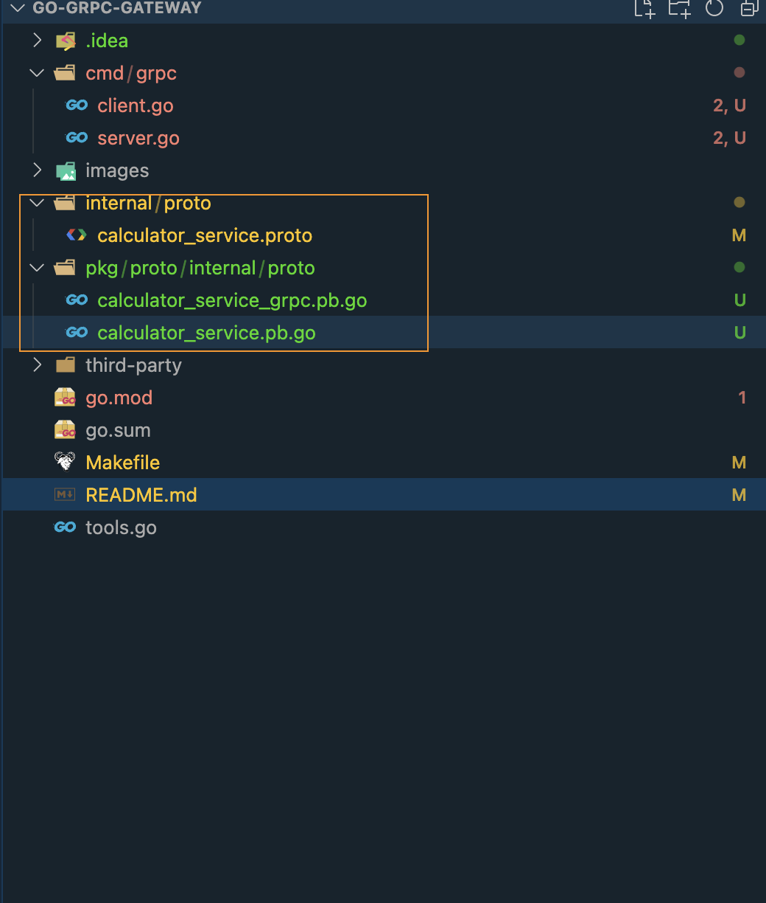
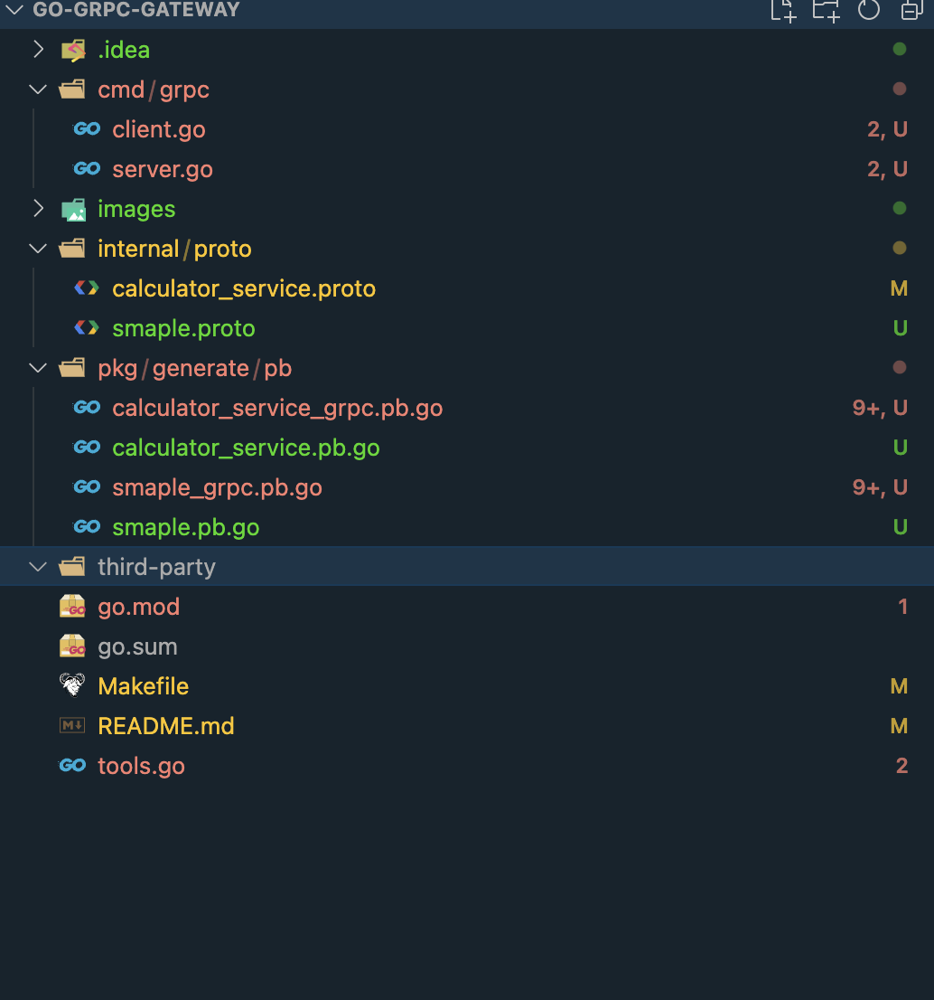

# go-grpc-gateway

## Overview

gRPC-Gateway helps you to provide your APIs in both gRPC and RESTful style at the same time.


## Document

- <https://github.com/grpc-ecosystem/grpc-gateway>
- <https://grpc-ecosystem.github.io/grpc-gateway/>

### Generate

- **Use default**

```proto
protoc --go_out=pkg/proto --go_opt=paths=source_relative \
--go-grpc_out=pkg/proto --go-grpc_opt=paths=source_relative \
internal/proto/calculator_service.proto
```



- **Use custom**

```proto
option go_package = "./pb";

protoc --go_out=pkg/generate --go_opt=Mprotos/*.proto=pb \
--go-grpc_out=pkg/generate --go-grpc_opt=Mprotos/*.proto=pb \
internal/proto/*.proto
```



- **Generate**

    - [Buf](https://buf.build/docs/tutorials/getting-started-with-buf-cli#update-directory-path-and-build-module)
    - [protoc](https://grpc.io/docs/languages/go/quickstart/)
    - [protobuf - generate ts/js to call grpc into resource](https://protobufjs.github.io/protobuf.js/)
    ```bash
        pbjs -t static-module \
            -w commonjs \
            -o $(APP_HOME)/server/pkg/presentation/all_in_one/ui/src/model.js \
            ec/v1/model/*.proto \
            ec/v1/if/*.proto 
        pbjs -t static-module \
            -w commonjs \
            -o $(APP_HOME)/server/external/ma/presentation/reservation/ui/src/model.js \
            ec/v1/model/*.proto \
            ec/v1/if/*.proto
    ```
